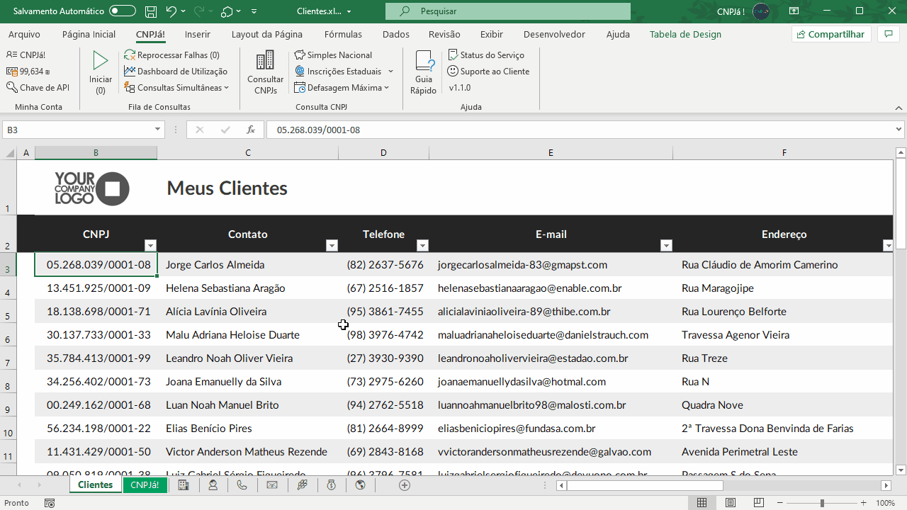

# CNPJá! Excel Add-in

Add-in para Excel, escrito em VBA, que permite consultar as informações de uma empresa na Receita Federal, Simples Nacional e Cadastro de Contribuintes.

## Utilização

Este repositório contém o código fonte e documentação referente a desenvolvimento.

Para instruções sobre como instalar ou utilizar a ferramenta acesse o guia oficial em:

[CNPJá! Documentação - Excel](https://docs.cnpja.com/excel/installation)

## Requisitos de Sistema

Sistema operacional Windows 7 ou superior.

Microsoft Office 365, 2016, ou superior.

## Desenvolvimento

O projeto utiliza ferramentas de suporte para importar e exportar os módulos e classes em VBA, bem como adicionar o menu customizado em XML.

Requisitos:

- [VSCode](https://code.visualstudio.com/) - Editor de texto
- [VSCode VBA](https://marketplace.visualstudio.com/items?itemName=spences10.VBA) - Extensão para suporte a linguagem VBA
- [XVBA Live Server](https://marketplace.visualstudio.com/items?itemName=local-smart.excel-live-server) - Sincronismo de módulo e classes, injeção do menu customizado

## Publicação

A distribuição é feita em arquivo `.exe` através da página oficial:

[CNPJá! Excel](https://www.cnpja.com/excel)

O instalador copia o add-in para a pasta de aplicações do usuário e o registra como habilitado em todas as pastas de trabalho do Excel.

A ferramenta utilizada para compilação está disponível em:

[DoneEx - Installer Maker](https://doneex.com/create-installer-for-excel-workbook/)

---

**© CNPJA TECNOLOGIA LTDA**
